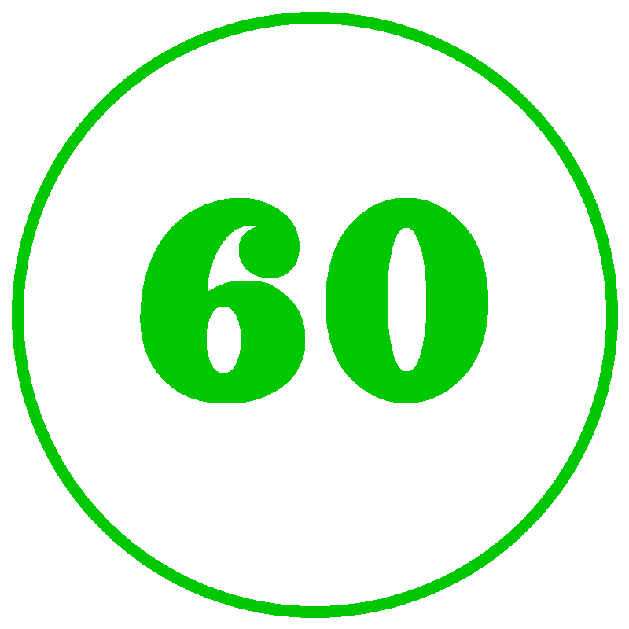

<p align="center">
  
</p>

<h1>iOS Workout Shortcut</h1>
  This apple shortcut is meant to function as a replacement for a workout application. What it does is give you a random workout from a set of exercises that you have chosen, not allowing you to repeat an exercise until all of them have been used. It allows you to input information about each exercise like weight, reps, and notes for each set that you do. It keeps this information stored in a .txt file and displays the information from the last time you completed each exercise as you get them again.

<h2>Example</h2>
  <p align="center">
    
  </p
    This example only goes through a couple of exercises with only one set each.
<h2>Setup</h2>
  <h3>Download</h3>
    The sharelink to the shortcut is here: <a href="https://www.icloud.com/shortcuts/ffbeaed5c5114ed1b9fbd04713948a48" target="_blank">Shortcut</a> 
    and the helper shortcut is here: <a href="https://www.icloud.com/shortcuts/c1da6a89488541788f95b134baab3db2" target="_blank">Helper</a>
  <h3>Folder Structure</h3>
    The default shortcut links to a folder called "Exercises" which inside has a .Gif file called "timer" which displays between your sets and two folders: "Data" and "GIFs".     Inside of the "Data" folder is two .txt files:      Exercise History.txt and Recent Exercises.txt. Lastly, the "GIFs" folder contains all of the .gif files of the exercises you wish to have available in your workout.
    <pre>
    Exercises
    ├─ GIFs
    │  ├─ pushup.gif
    │  ├─ squat.gif
    │  ├─ bicep curl.gif
    │  ├─ etc.
    ├─ Data
    │  ├─ Recent Exercises.txt
    │  ├─ Exercise History.txt
    timer.gif
    </pre>
    
  <h3>Exercise GIFs</h3>
    You can get any .gif file for any exercise you would like, but if you want a consistant style of gif like I did, I would recommend using <a href="https://github.com/ExerciseDB/exercisedb-api" target="_blank">ExerciseDB</a> and their <a href="https://www.exercisedb.dev/docs" target="_blank">V1 API Playground</a> to search for a gif of (mostly) any exercise.

  <h3>Timer GIF</h3>
    Originally, I wanted a timer of 20 seconds for my rest period. I found it difficult to find a timer for that amount of time, so I decided to write some Python code that would make the gif for me.
    
```python
from PIL import Image, ImageDraw, ImageFont
import math
import numpy

def makeGradient(startColor, endColor, colorSteps):
    gradient = numpy.linspace(startColor,endColor,num= colorSteps,dtype=int)
    return gradient

def makeTimer(time, size, startColor, endColor, fontPath, outputPath):
    frames = []
    center = size // 2
    gradient = makeGradient(startColor, endColor, time)
    angleSteps = 360 / time
    if fontPath is None:
        font = ImageFont.load_default()
    else:
        font = ImageFont.truetype(fontPath, size // 2)
    for i in range(time):
        color = tuple(gradient[i])
        img = Image.new('RGBA', (size, size), (0, 0, 0, 0))
        draw = ImageDraw.Draw(img)
        d = ImageDraw.Draw(img)
        margin = 15
        bbox = (margin, margin, size - margin, size - margin)

        angleSteps = 360 / time

        startAngle = 0
        endAngle = 360 - (angleSteps * (i))
        d.arc(bbox, startAngle, endAngle, fill = color, width = 15)

        timeText = str(time - i)
        textBbox = draw.textbbox((0,0), timeText, font = font)
        draw.text((center, center), timeText, font=font, fill=color, anchor="mm")

        frames.append(img)

    frames[0].save(
        outputPath,
        save_all=True,
        append_images=frames[1:],
        duration=1000,  # 1 sec per frame
        loop=0,
        disposal=2
    )

makeTimer(
    time = 60, 
    size = 800, 
    startColor = (0,200,0),
    endColor = (200,0,0), 
    fontPath = "assets/Magic Vintage TTF.ttf",
    outputPath = "assets/timer.gif")

```

  The code allows you to set the time interval you would like for your rest period, a start and end color for the timer to transition between, and a font for the numbers. NOTE: If you don't provide a font, the default that PIL provides ends up being really small and almost defeats the purpose of having the text there to begin with.

<p align="center">
  
</p>

<h2>Demo</h2>

<h2>Known Problems</h2>
  <ul>
      <li>Sometimes not all of the characters will be saved after entering data into the Set info popup. I suggest clicking into another textbox when you're done putting in your last item. This is a problem on Apple's end.</li>
      <li>I don't claim that this shortcut is optimized at all, this was just a project I was working on as a proof of concept to teach myself how shortcuts work and what they are capable of.</li>
  </ul> 

<h2>Full Shortcut</h2>
  
